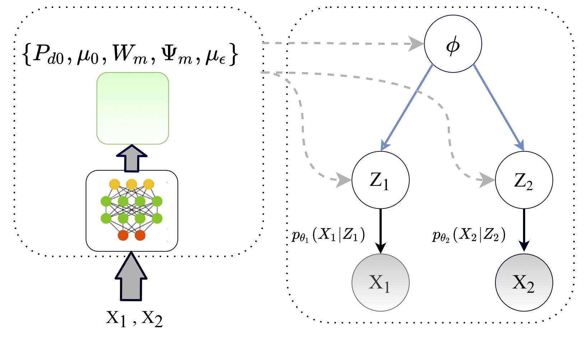
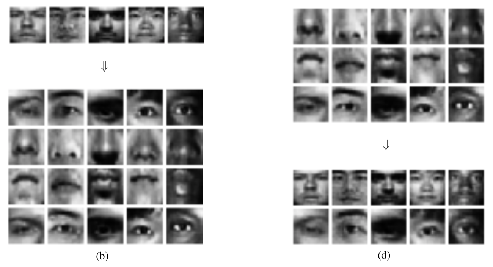

# Deep-Probabilistic-Multi-View

This repository contains the official Tensorflow implementation of
the paper ["Deep Probabilistic Canonical Correlation Analysis"](https://ojs.aaai.org/index.php/AAAI/article/view/16982) 
presented in AAAI 2021.

> **Abstract**  
We propose a deep generative framework for multi-view learning
based on a probabilistic interpretation of canonical correlation
analysis (CCA). The model combines a linear multi-view
layer in the latent space with deep generative networks as
observation models, to decompose the variability in multiple
views into a shared latent representation that describes the
common underlying sources of variation and a set of viewspecific
components. To approximate the posterior distribution
of the latent multi-view layer, an efficient variational inference
procedure is developed based on the solution of probabilistic
CCA. The model is then generalized to an arbitrary number of
views. An empirical analysis confirms that the proposed deep
multi-view model can discover subtle relationships between
multiple views and recover rich representations.




## Requirements
The latest release of the code is tested with:
  * `python 3.6`
  * `tensorflow 1.14.0`


Dependencies can be installed via

```pip install -r requirements.txt```


## Usage
To train the model, simply run:
```python main.py --mode train```  
For more specific training, run the following scripts inside the directory: ```./exp``` :
* **Two-View Noisy MNIST**:  
```source Noisy_MNIST_2V.sh ```
  - **Dataset**: follow the instruction in 
[link1](https://bitbucket.org/qingming_tang/deep-canonical-correlation-analysis/src/master/),
[link2](https://home.ttic.edu/~wwang5/dccae.html)
[link3](https://github.com/VahidooX/DeepCCA)
  

* **Multi-Modal YaleB (Facial Components)**:  
```source YaleB_multimodal.sh ```

  >**Reconstruction of missing views**  
  >   
  > *Samples of the available views, at the top, and their corresponding reconstructed views where in (b) the model extracts the 4 facial
components based on the complete face image, and in (d) the model reconstructs the whole face and the one facial component (right eye) based
on its 3 partial face complements (left eye+ nose+mouth)*.


## Cite
Please cite our paper if you use this code in your research work.

```
@inproceedings{karami2021deep,
  title={Deep Probabilistic Canonical Correlation Analysis},
  author={Karami, Mahdi and Schuurmans, Dale},
  booktitle={Proceedings of the AAAI Conference on Artificial Intelligence},
  pages={8055--8063},
  year={2021}
}
```


## Questions/Bugs
Please, submit a Github issue or contact karami1@ualberta.ca .